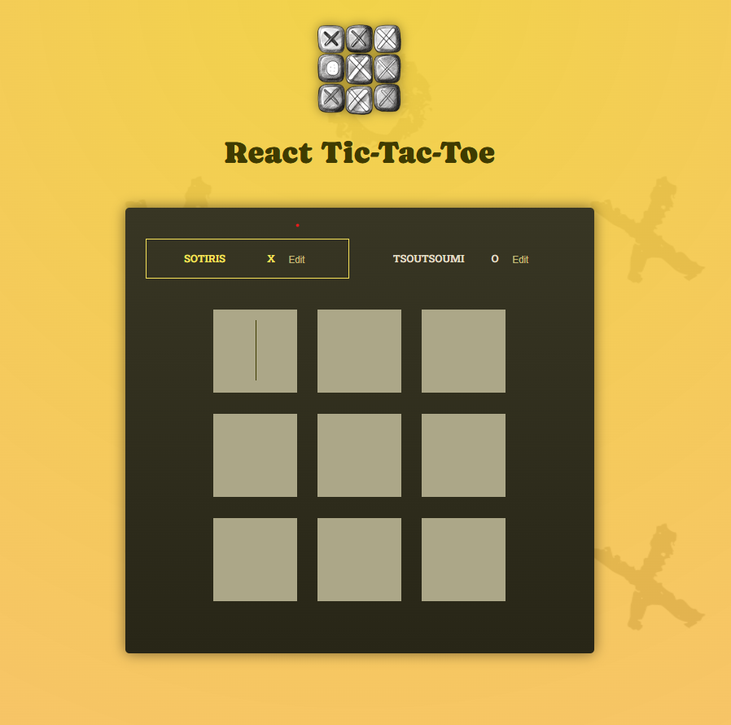

# 🎮 React Tic-Tac-Toe

A simple Tic-Tac-Toe game built with React.

## 🚀 Features

- Interactive 3x3 game board
- Turn-based player switching (X / O)
- Derived game state logic
- Winner detection
- Immutable state updates
- Clean component structure

## 🧠 Concepts Practiced

- React `useState`
- Derived state
- Immutability
- Array mapping
- Conditional rendering
- Component composition

## 🛠 Tech Stack

- React
- JavaScript (ES6+)
- CSS

- 
